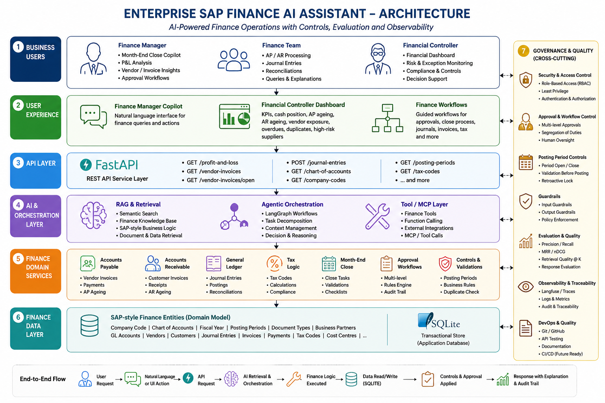

# Enterprise SAP Finance AI Assistant


# Project Overview


The Enterprise SAP Finance AI Assistant is a portfolio project designed to demonstrate how AI can support finance operations in an SAP-style enterprise environment.


The project combines finance-domain workflows, controlled AI assistance, approval logic, evaluation, observability, security controls and agentic workflow concepts into one end-to-end platform.


The objective was not simply to build a chatbot. The project was designed to show how AI can be integrated into realistic finance processes while preserving governance, business controls and explainability.


## Project Evidence Snapshot

- Completed through a structured 24-module build.
- Implements 60 unique FastAPI method-and-path combinations.
- Contains 36 Python service modules under `src`.
- Covers General Ledger, Accounts Payable, Accounts Receivable, tax, journal processing, posting-period control, month-end close, approval workflows, governance and evaluation.
- Includes seven executable API and tool-validation scripts. These are demonstration scripts rather than a fully automated pytest suite.
- Uses mock SAP-style data and domain models; it does not claim connection to or implementation within a live SAP S/4HANA environment.

## Business Problems Addressed
The platform supports finance teams with use cases including:


- Month-end close support

- Profit and loss analysis

- Accounts payable and receivable workflows

- Vendor invoice review

- Journal entry controls

- Posting period validation

- Duplicate and high-risk transaction identification

- Approval workflows

- Finance dashboard insights

- AI-assisted finance decision support


## Solution Capabilities


The completed solution includes:


- Finance Manager Copilot

- Financial Controller dashboard

- SAP-style finance data and business logic

- Company Code and local currency handling

- Fiscal year and posting period controls

- Accounts Payable and Accounts Receivable workflows

- Tax logic

- Journal entry processing

- Trusted approval workflows

- Role-based access controls

- Input and output guardrails

- Retrieval and response evaluation

- Precision, Recall, MRR and nDCG evaluation concepts

- Agentic finance workflow patterns

- Observability and traceability

- API-based service architecture


## Architecture


The solution is structured around several logical layers:


1\. Finance and SAP-style business data

2\. Business logic and finance services

3\. API and tool layer

4\. AI / retrieval / agent orchestration layer

5\. Security and approval controls

6\. Evaluation and observability

7\. User-facing finance workflows and dashboards


### Solution Architecture


The diagram below presents the solution architecture, combining implemented prototype components with enterprise integration and deployment patterns demonstrated conceptually by the project.



> **Implementation scope:** This portfolio project uses a Python and FastAPI application, SQLite persistence, and SAP-style finance domain models. It is not connected to a live SAP S/4HANA environment. MCP integrations, enterprise orchestration, and CI/CD are represented as solution patterns and should not be interpreted as commercially deployed integrations.


## Technology Stack


Key technologies and concepts used across the project include:


- Python

- FastAPI

- REST APIs

- SQLite

- LangChain / LangGraph concepts

- Retrieval-Augmented Generation

- Agentic AI patterns

- MCP / tool-based integration concepts

- LLM evaluation

- Git and GitHub

- Role-Based Access Control

- AI guardrails

- Observability

- SAP S/4HANA Finance concepts


## Finance Domain Coverage


The project applies AI engineering concepts specifically to enterprise finance rather than treating finance as generic sample data.


Finance concepts covered include:


- General Ledger

- Accounts Payable

- Accounts Receivable

- Tax

- Company Code

- Chart of Accounts

- Fiscal Year

- Posting Periods

- Document Types

- Business Partners

- Journal Entries

- Vendor Invoices

- Month-End Close

- Financial Controls

- Approval Workflows


## Governance and Controls


A major design principle of the project is that AI should not bypass finance controls.


The solution therefore incorporates concepts including:


- Least-privilege access

- Role-based permissions

- Controlled journal posting

- Posting-period validation

- Approval gates

- Human oversight

- Input and output guardrails

- Traceability

- Evaluation

- Auditability


## Evaluation


The project includes retrieval and AI quality evaluation concepts including:


- Precision

- Recall

- Mean Reciprocal Rank (MRR)

- Normalised Discounted Cumulative Gain (nDCG)

- Retrieval quality at different values of K

- Response quality and traceability


These measures are used to demonstrate that AI output should be evaluated systematically rather than judged only by whether a response appears plausible.

## Run Locally

From the repository root, create and activate a Python virtual environment:

```powershell
python -m venv venv
.\venv\Scripts\Activate.ps1
```

Install the project dependencies:

```powershell
pip install -r requirements.txt
```

Start the mock SAP Finance API:

```powershell
uvicorn mock_sap.app:app --host 127.0.0.1 --port 8001
```

Open the interactive API documentation at:

```text
http://127.0.0.1:8001/docs
```

The application uses mock SAP-style finance data and is intended for portfolio demonstration and local evaluation.


## Project Status

Modules 1-24 are complete, and the build phase is closed.

The demonstration video has been recorded and is final. No additional recording or feature development is planned.

The project is now in the portfolio-packaging phase:

1. Complete the employer-facing README.
2. Create the architecture diagram.
3. Extract three evidence-based CV bullets.
4. Prepare the verbal interview story.
5. Complete the final GitHub quality check.
